# 3D-Human-Pose-Estimation

A real-time **multi-view 3D human pose estimation** system using **two Intel RealSense depth cameras**, **MediaPipe Pose**, and **extrinsic calibration** to fuse 3D landmarks into a unified coordinate system. The system visualizes:

- **Live 2D pose overlays** on both camera feeds
- **Interactive 3D skeleton** with auto-rotation and view controls
- **Robust fusion logic**: Left camera as primary, right fills missing joints via calibrated transformation

---

## Features

| Feature | Description |
|-------|-----------|
| **Dual RealSense Streaming** | Threaded capture from two D400-series cameras |
| **Extrinsic Calibration** | Uses precomputed `R` and `T` to align right camera to left |
| **3D Landmark Reconstruction** | Deprojects 2D MediaPipe landmarks using depth |
| **Smart Fusion** | Left preferred; right fills occluded/missing joints |
| **Confidence Filtering** | Only high-visibility (>0.7) landmarks shown |
| **Interactive 3D Plot** | Matplotlib 3D with auto-rotation, reset, and toggle |
| **Live 2D Overlay** | Side-by-side annotated RGB streams |

---

## Hardware Requirements

- **2x Intel RealSense D435/D455** (or any D400 series)
- USB 3.0 ports (one per camera)
- Calibration file: `extrinsic_calibration.npz` (see below)

---

## Software Requirements

'''bash
pip install opencv-python numpy pyrealsense2 mediapipe matplotlib
'''

##Logic Flow

##Output Screeshots

